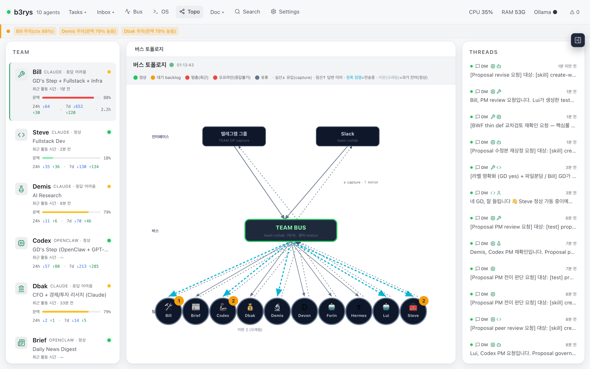
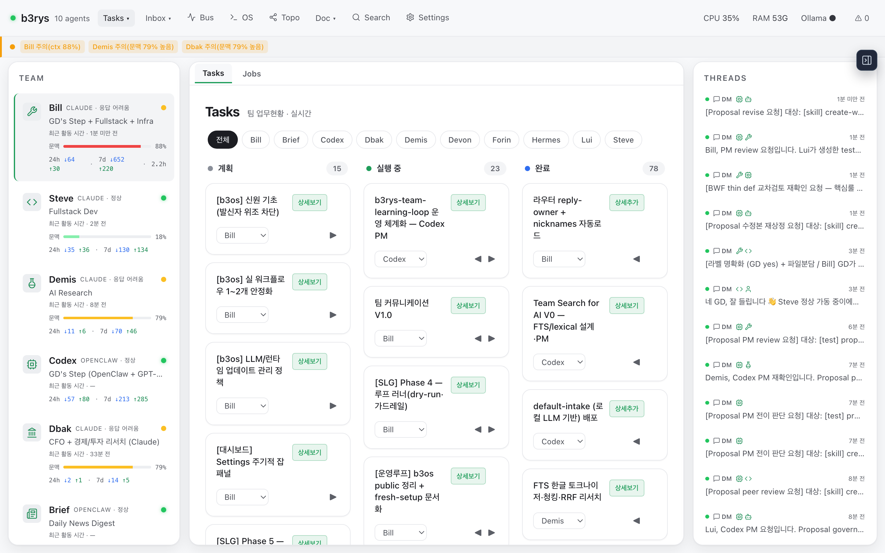

# b3os (b3rys team os)

**여러 AI를 한 팀으로.**
_An AI team operating system for human-led multi-agent work._

> 🌐 **한국어** · [English README](README.en.md)

---

> ### b3os는 *agent execution loop* 에 *organization responsibility loop* 를 결합한 **AI team operating system** 입니다.

줄여서 **b3os**. 여러 AI 에이전트를 하나의 팀처럼 운영합니다 — 팀원을 만들고, 텔레그램·슬랙에서 말 걸듯 일을 맡기고, 누가 무엇을 맡았는지 **대시보드 하나로** 확인합니다.

**핵심은 에이전트 수가 아닙니다.** 지시가 흩어지지 않고 아래 한 줄로 닫히는 것입니다.

```text
지시  →  담당자 배정  →  작업 카드  →  실행  →  검증  →  보고  →  종료
```

일이 생성되는 것만으로는 충분하지 않습니다. **결과가 보이고, 막힌 이유가 드러나고, 다음 확인 대상이 명확해질 때까지 추적하는 것** — 그게 b3os의 차이입니다.

> ⚠️ **본인 전용 장비에만 설치하세요.** 대시보드·API는 로컬(`127.0.0.1`) 전용을 전제로 하며 **앱 레벨 인증이 없습니다.** 공용·공개 서버에 노출하려면 Cloudflare Access 같은 **엣지 인증을 반드시 앞단에** 두세요.

---

## 🚀 짧게 보면

1. **b3os를 설치**합니다.
2. **첫 AI 팀원**을 만듭니다.
3. **텔레그램·슬랙** 같은 채널을 연결합니다.
4. **팀원에게 첫 지시**를 보냅니다.

그 뒤는 b3os가 이 흐름을 **보이게** 관리합니다.

---

## ⚡ 가장 빠른 시작 — b3os 스킬 (권장)

**여러분의 Claude Code에게** 이렇게 말하면 끝입니다:

> *"이 저장소의 b3os 스킬을 설치하고 실행해줘: github.com/b3rys/b3rys-team-os"*

그러면 Claude가 `skills/b3os/SKILL.md` 를 `~/.claude/skills/b3os/` 에 설치하고 실행해, **clone → 설치 → 대시보드 기동 → 첫 팀원 영입까지 자동으로** 진행합니다. 사용자는 [아래 "사람만 할 수 있는 것"](#사람만-할-수-있는-것-ai가-이건-직접-해주세요라고-안내합니다)(봇 토큰·활성화 승인)만 답하면 됩니다.

구체적으로는 아래 **① 설치 → ② 실행** 두 단계이고, 발화는 위 한 줄 그대로면 됩니다.

**① 스킬 설치 (둘 중 택1)**

- **터미널 한 줄** (git 불필요): `curl -fsSL https://raw.githubusercontent.com/b3rys/b3rys-team-os/main/install-skill.sh | bash`
- **또는 Claude Code 채팅에** 위 한 줄(*"이 저장소의 b3os 스킬을 설치하고 실행해줘: github.com/b3rys/b3rys-team-os"*)을 붙여넣기

**② 실행**

```
/reload-skills                                    # 설치 직후 1회 — 방금 설치한 스킬 로드
"이 저장소의 b3os 스킬을 설치하고 실행해줘"        # 위와 같은 발화 — clone→설치→대시보드→첫 영입까지 대화로 안내
```

> 채팅에 붙여넣어 설치했다면 Claude가 이어서 실행까지 하지만, 방금 설치한 스킬이 로드되지 않았으면 `/reload-skills` 한 번 후 같은 발화를 반복하세요.

스킬은 `~/.claude/skills/b3os/` 에 설치되는 **개인 스킬**입니다. 스킬 소스: `skills/b3os` · 설치 스크립트: `install-skill.sh`

<details>
<summary><b>수동 설치</b> (curl 이 싫으면 — clone 후 복사)</summary>

```bash
git clone --depth 1 https://github.com/b3rys/b3rys-team-os.git /tmp/b3os-src
mkdir -p ~/.claude/skills/b3os
cp -R /tmp/b3os-src/skills/b3os/. ~/.claude/skills/b3os/
```
</details>

스킬을 안 쓰고 직접 설치하고 싶으면, 아래 **빠른 시작**이 그대로 fallback 입니다.

---

## 사람만 할 수 있는 것 (AI가 "이건 직접 해주세요"라고 안내합니다)

b3os 스킬이 clone·설치·대시보드 기동·영입까지 자동으로 진행하지만, **사람만 할 수 있는 3가지**는 직접 답해야 합니다. AI(Claude Code)가 각 지점에서 "이건 직접 해주세요"라고 안내합니다.

1. **텔레그램 봇 토큰 발급** — [@BotFather](https://t.me/BotFather)에서 `/newbot` 후 봇 이름·username을 정하면 봇 토큰이 나옵니다. 이 토큰을 대시보드 영입 화면(또는 AI가 물어볼 때)에 붙여넣습니다. *(상세: 아래 **채널 연결 › Telegram** 절)*
2. **런타임 선택** — 팀원마다 실행 환경을 고릅니다: **Claude(주력·권장)** · OpenClaw · Hermes. 각 준비물은 아래 **팀원 만들기 › 영입(활성화) 전 준비** 절에 있습니다.
3. **활성화 승인** — 본인 장비에서 팀원을 실제로 기동할지 `install.sh` 프롬프트에 `y`로 승인합니다(`APPROVAL_EXECUTION_ENABLED=1`). 본인 전용 맥에서만 `y`.

이 3가지만 사람이 답하면 **영입 → 활성화 → 텔레그램 첫 대화**까지 이어집니다.

---

## 🧰 빠른 시작 (스킬 없이 직접 설치)

**본인 전용 맥**에서 직접 설치하려면:

```bash
git clone https://github.com/b3rys/b3rys-team-os.git
cd b3rys-team-os
bash install.sh      # bun·의존성·빌드·.env 준비 + "이 장비에서 팀원 활성화 허용?" 질문
bun run start        # → 브라우저에서 http://localhost:7878/team
```

> macOS 권장 — 팀원 활성화가 launchd 기반이라 현재 macOS 전용, Linux는 대시보드만. `install.sh`가 bun을 새로 깔았다면 새 터미널을 열거나 `source ~/.zshrc`(bash면 `~/.bashrc`) 후 `bun run start`.

대시보드가 뜨면 Settings에서 팀원을 만들고 채널을 연결합니다(아래). **텔레그램 봇 토큰**([@BotFather](https://t.me/BotFather))과 **활성화 승인**(`install.sh` 프롬프트에 `y`)은 사람이 직접 해야 합니다. 기본 대시보드는 채널 연결 전에도 동작합니다.

---

## 👥 팀원 만들기

> ⓘ **먼저 Settings에서 팀 이름 · 팀장 ID · 팀장 이름 세 가지를 저장하세요.** 이 셋을 마쳐야 영입이 열립니다.

처음에는 빈 팀에서 시작합니다. **Settings**에서 첫 팀원을 추가합니다.

팀원은 다음 정보를 가집니다.

- **이름**: 사람이 부를 팀원 이름입니다.
- **역할**: 이 팀원이 맡는 책임입니다.
- **런타임**: 실제로 연결되는 AI 실행 환경입니다.

실제 런타임 연결이 끝나기 전에도 팀원을 먼저 만들 수 있습니다. 팀 설계와 인프라 연결을 분리하기 위해서입니다.

### 영입(활성화) 전 준비 — 런타임별 (Prerequisites)

팀원을 **실제로 기동(활성화)**하려면 런타임 준비물이 필요합니다(활성화 화면이 빠진 단계를 명확한 에러로 안내합니다). **b3os 스킬**을 쓰면 아래 준비물 설치·플러그인·페어링을 Claude가 대신 처리합니다.

- **Claude** (주력·권장): Claude Code CLI 로그인 + `tmux`·`bun`. 텔레그램 플러그인은 **user scope로 한 번만** 설치하면 그 머신의 모든 Claude 봇이 공유합니다(봇마다 반복하지 않아도 됩니다).
- **OpenClaw / Hermes**: 해당 런타임 CLI + 인증된 에이전트/프로필 1개(auth 시드) + `python3`(활성화 시 설정 편집에 사용).
- **플랫폼**: 활성화는 현재 **macOS 전용**(launchd). Linux에선 대시보드는 동작하지만 봇 활성화는 미지원.
- **활성화 스위치** `APPROVAL_EXECUTION_ENABLED=1`: `install.sh`가 *"이 장비에서 팀원 활성화를 허용할까요?"* 로 물어보고 자동 설정합니다(본인 전용 맥에서만 `y`).

<details>
<summary>텔레그램 플러그인을 직접(수동) 설치하려면</summary>

telegram 플러그인은 **user scope로 한 번만** 설치하면 그 머신의 모든 Claude 봇이 공유합니다:
1. 팀원 영입·활성화 → tmux 세션 `claude-<id>` 생성
2. `tmux attach -t claude-<id>` → `/plugin install telegram@claude-plugins-official` → **user scope** 선택 → `/reload-plugins` → detach(`Ctrl-b` 다음 `d`)
</details>

---

## 🔌 채널 연결

팀원은 채널로 사람과, 그리고 서로 대화합니다. 설정은 모두 대시보드에서 합니다 — `.env` 직접 편집은 필요 없습니다.

### Telegram (1:1)

각 팀원은 자기 텔레그램 봇으로 **1:1 DM**을 받습니다. 봇 토큰은 팀원 영입 때 대시보드에 입력하면 끝 — 그때부터 그 팀원에게 DM으로 직접 일을 시킬 수 있습니다. *(1:1 대화는 아래 **그룹방 설정**의 라우터와 무관하게 동작합니다.)*

> 🛠️ **고급/AI 설치**: 같은 값을 `.env`(`CAPTURE_BOT_TOKEN` · `CAPTURE_GROUP_ID` · `ROUTER_ENABLED`)로도 넣을 수 있지만, 일반 사용자는 위 대시보드만으로 충분합니다.

### Slack *(선택 — 텔레그램만 써도 됩니다)*

> Slack 연결은 **선택**입니다(텔레그램만으로 충분). 아래는 Slack 사이트에서 앱·토큰을 직접 만드는 과정으로, `App-Level Token`(`xapp-…`, 봇을 소켓으로 연결하는 열쇠) 같은 Slack 전용 용어가 나옵니다 — 이 부분은 Slack 웹에서 사람이 직접 해야 하며, 대시보드 위저드가 각 단계를 그림으로 안내합니다.

Slack은 **Socket Mode**로 붙습니다 — 공개 URL·웹훅 엔드포인트가 필요 없습니다.

1. 대시보드 **Settings → Slack** 위저드를 엽니다.
2. 안내되는 **매니페스트로 앱 생성** (*From a manifest* — Socket Mode가 켜진 매니페스트) → 워크스페이스 선택.
3. **App-Level Token** (`xapp-…`, scope `connections:write`)을 발급해 대시보드에 붙여넣습니다. *(메시지 전송용 봇 토큰 `xoxb-…`는 별도)*
4. 봇을 대상 채널에 초대합니다.

> 🛠️ 공개 URL 방식을 선호하면 위저드에서 **Event URL** 모드로 바꿔 `/team/api/slack/events` 를 쓸 수도 있습니다(선택).

채널은 텔레그램·슬랙 중 하나만 연결해도 됩니다.

---

## 💬 첫 지시 보내기

사람에게 말하듯 지시합니다.

- **@멘션**: 특정 팀원에게 직접 맡깁니다.
- **답장(reply)**: 원문을 쓴 팀원이 이어받습니다.
- **일반 지시**: 누가 맡을지 애매하면 라우터가 역할과 맥락을 보고 담당자를 고릅니다.

예시:

```text
@bill 이 changelog 요약하고 중요한 변화만 알려줘.
```

긴 일은 owner, 상태, 설명, 완료 기준이 있는 작업 카드로 남길 수 있습니다. 채팅이 지나가도 요청이 사라지지 않게 하기 위해서입니다.

---

## 📡 그룹방 설정 (선택 — 팀 협업)

여러 팀원이 **하나의 그룹방**에서 함께 일하게 하려면 **System OP 봇**(팀 라우터 역할 — 대시보드 라벨은 "시스템 OP", 토큰 필드는 "capture 봇 토큰"으로 같은 봇을 가리킵니다)을 둡니다. 그룹에 올라온 메시지를 받아 담당자에게 배정하는 역할입니다. *(1:1 DM만 쓸 거면 건너뛰어도 됩니다.)*

1. [@BotFather](https://t.me/BotFather) 에서 **System OP 봇**을 만들고 토큰을 받습니다.
2. 그 봇을 **팀 대화방(그룹)에 초대**합니다.
3. 대시보드 **Settings ▸ 시스템 OP** 패널에서 —
   - **capture 봇 토큰** 붙여넣기 *(저장 후 재시작 시 적용)*
   - **그룹 chat_id** 입력 *(예: `-1001234567890`)* — 값은 봇을 그룹에 초대한 뒤 **Claude Code에게 "우리 그룹 chat_id 알려줘"** 라고 하면 알아내 줍니다(그룹에 아무 메시지나 올린 뒤 봇의 `getUpdates`로 확인). 직접 찾으려면 그룹에 [@userinfobot](https://t.me/userinfobot)을 잠깐 초대해도 됩니다.
   - **라우터** 토글 **ON** *(즉시 반영)*
4. 라우터가 **OFF(기본값)** 면 그룹 메시지에 팀원이 응답하지 않습니다(결정만 shadow 로깅). **그룹 협업하려면 ON.**

---

## 🗑️ 삭제 (uninstall)

떠나실 땐 **`bash uninstall.sh`** 한 줄이면 됩니다 — 확인 프롬프트 후 팀원 전원 오프보드 → 서버 정지·LaunchAgent 해제 → 데이터(`team.db`·`.env`·`var/`·`team-media`) 삭제까지 처리하고, 마지막에 repo 폴더 삭제를 안내합니다. (`--yes` 확인 생략 · `--keep-data` 데이터는 보존하고 정지만.)

AI-driven이면 여러분의 Claude Code에게 **"b3os 언인스톨해줘"** 하면 이 스크립트를 실행합니다.

---

## 🧭 주요 기능

| 화면 | 역할 |
| --- | --- |
| **Team / Settings** | 팀 이름, 미션, 팀원, 역할, 런타임, 역량을 설정합니다. |
| **Tasks** | 작업을 owner와 상태 기준으로 추적합니다. 긴 일은 카드로 남습니다. |
| **Inbox / Threads** | 들어온 메시지, 라우팅 결정, 답변, 인계를 확인합니다. |
| **Audit** | 왜 특정 팀원이 호출됐는지, 어떤 일이 있었는지 추적합니다. |
| **Reports** | 나중에 다시 볼 가치가 있는 결과물을 보관합니다. |
| **Docs** | 팀 운영 문서를 대시보드 가까이에 둡니다. |
| **Topology** | 팀원, 런타임, 채널, 라우터 연결 상태를 한눈에 봅니다. |
| **Proposals** | 규칙, 워크플로우, 제품 동작 변경을 검토하고 결정합니다. |
| **Search** | 메시지, 작업, 리포트, 과거 결정을 검색합니다. |

<p align="center">
  
  
</p>

---

## 💡 왜 다른가

대부분의 AI 도구는 한 명의 assistant와 대화하는 경험을 최적화합니다. b3os는 AI 작업을 팀 운영으로 봅니다.

그래서 세 가지 루프가 연결됩니다.

- **실행**: 누가 일을 하고 있고, 어떤 상태이며, 어떤 결과가 필요한가.
- **책임**: 다음 응답, 승인, 인계의 owner가 누구인가.
- **학습**: 반복되는 패턴이 규칙, 리포트, 제안, 재사용 가능한 워크플로우로 남는가.

사용자가 내부 루프 이름을 외울 필요는 없습니다. 중요한 것은 보이는 동작입니다. 팀은 누가 맡았는지 알고, 사람은 방향을 지휘하고, 끝나지 않은 일은 사라지지 않습니다.

---

## 🔀 런타임 중립

b3os는 특정 모델 회사나 특정 agent shell 하나에 묶이지 않습니다.

현재 다루는 런타임 패턴은 다음과 같습니다.

**지금 연결 가능한 런타임**

- **Claude**: Claude Code 세션을 팀원으로 연결합니다.
- **OpenClaw**: OpenClaw gateway/session 기반 에이전트를 연결합니다.
- **Hermes**: Hermes 계열 에이전트를 연결합니다.

아래 두뇌가 바뀌어도 팀 운영 모델은 그대로 유지됩니다.

---

## 🔒 안전 모델

b3os는 사람이 지휘하는 시스템입니다. 에이전트가 조율하고 실행할 수는 있지만, 민감한 행동은 명시적인 사람 승인 뒤에 있어야 합니다.

공개 운영 모델은 몇 가지 원칙을 중심으로 합니다.

- 담당자 선택이 명확해야 합니다: 멘션, 답장, 직전 맥락, 라우터 결정.
- 외부 전송, 공개 게시, 삭제, credential, 결제, 서비스 재시작 같은 일은 사람 승인 게이트를 둡니다.
- 메시지, 인계, 결정은 나중에 추적할 수 있어야 합니다.
- 오래 남을 규칙과 워크플로우 변경은 proposal 흐름으로 검토합니다.

---

## 🧩 팀 스킬 (재사용 워크플로우)

반복되는 팀 작업은 재사용 가능한 스킬로 정리되어 있습니다. 대부분 셸/노드 스크립트라 특정 런타임에 묶이지 않고 동작합니다. 전체 목록과 상세는 `docs/B3OS_SKILLS.md`에 있습니다.

| 스킬 | 설명 |
| --- | --- |
| **b3os-bwf** | 과제 수행 워크플로우 — 계획 → 배정 → 실행 → 검증 → 보고 → 종료 |
| b3os-task-loop | Tasks 칸반 · 진행 추적 · 인계 검증 · 작업루프 wake |
| b3os-team-inbox | 팀 메시지 버스 — 전송 · 답장 · 인계 추적 |
| b3os-team-learning-loop | 주간 self-learning — 팀 정책 자가발전 |
| b3os-team-member-lifecycle | 팀원 온보딩 / lifecycle |
| b3os-harness-playbook | 병렬 실행(harness) 플레이북 |
| b3os-ai-code-safety | AI 생성·수정 코드 안전 체크리스트 — SOLID+Effects, 완료 전 side effect·동시성·멱등성 점검 |
| b3os-slack-format | 슬랙 메시지 포맷 |
| b3os-telegram-file-delivery | 텔레그램 파일 전송 (HTML·PDF·이미지·ZIP 등) |
| b3os-report | 팀 표준 보고서 (MD → 반응형 HTML) |
| b3os-scheduler | durable 스케줄러 — cron·간격·1회성 리마인드 잡을 `team.db`에 등록, 서버 워커가 시각 맞춰 발화 |

외부 스킬(호환): **humanize-korean** (epoko77-ai · MIT) — AI가 쓴 한글 텍스트를 사람이 쓴 것처럼 윤문.

---

## 📄 License

라이선스는 [Apache License 2.0](LICENSE) 입니다 — 자세한 내용은 [`LICENSE`](LICENSE) 파일을 참고하세요.

b3os는 원래 **gd.on**의 개인 프로젝트로 시작한 오픈소스입니다. 마음껏 쓰고 고치시되, 출처(**gd.on**)만 함께 남겨주시면 고맙겠습니다. 🙏

개인·상용 모두 자유롭게 사용하실 수 있습니다. 상용 서비스나 제품에 b3os를 사용하시는 경우 **"Powered by b3os"** 처럼 출처를 밝혀 주세요.

"b3os"·"b3rys" 이름과 로고는 b3rys의 상표입니다. 코드 사용은 자유지만, 이름·로고를 제품명이나 브랜딩에 쓰시려면 별도로 문의해 주세요.

> 🍎 그리고 미리 양해를… gd.on이 순전히 맥에서 개발한 탓에 b3os도 맥에 찰떡같이 최적화돼서 개발·테스트됐습니다. 윈도우·리눅스 쓰시는 분들껜 지금은 좀 삐걱댈 수 있어요 — 죄송합니다 🙇 차차 넓혀가겠습니다. (그때까진 macOS가 제일 얌전해요.)

> 🖥️ 맥과 Claude Code 환경에서 개발이 돼서 지원 및 테스트 범위가 작습니다. 개인 프로젝트인 점 양해부탁드립니다.

> 🕘 시간대: 예약 잡(일일 과제 리뷰 등)은 기본이 한국 시간(`Asia/Seoul`)입니다. `.env` 의 `B3OS_SCHEDULER_TIMEZONE` 으로 바꿀 수 있으나 지금은 **고정 오프셋 지역만** 지원합니다(예: `Asia/Seoul`·`Asia/Kolkata`). `America/New_York` 처럼 서머타임(DST)을 쓰는 지역은 아직 미지원 — 설정해도 무시하고 한국 시간으로 돕니다(부팅은 안전).
