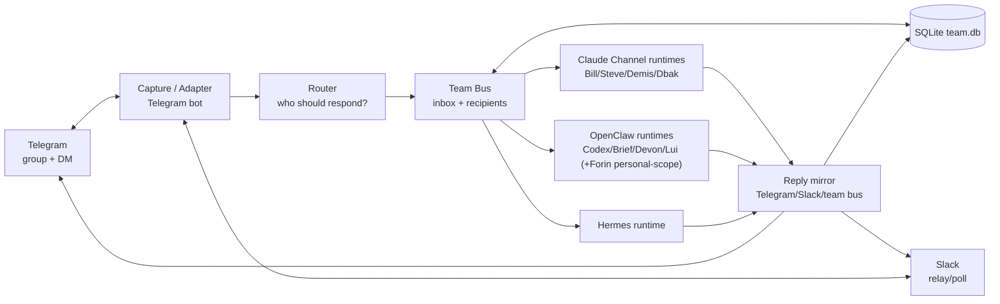
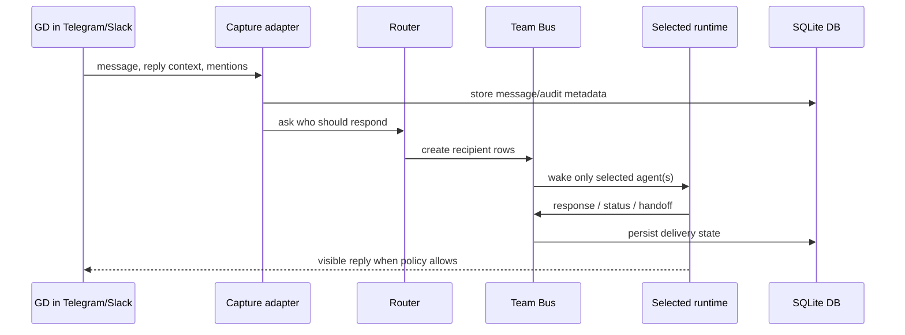
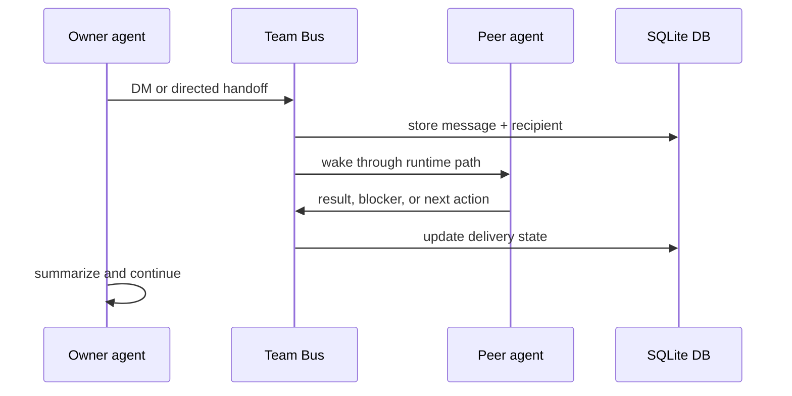
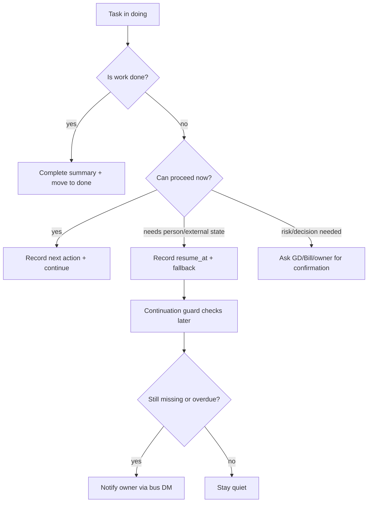
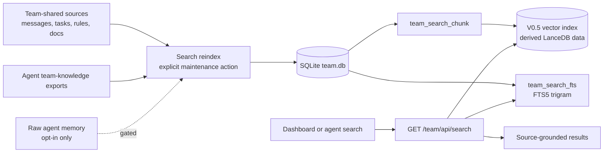

# b3rys Communication Flow

> Status: active reference
> Scope: Telegram/Slack, runtimes, router, team bus, DB, and reply paths

This document explains how team communication moves through the system. It replaces the narrower "routing flow" framing: routing is only one part of the full communication flow.

## High-Level Architecture



The short version:

- External channels are Telegram and Slack.
- `team-collab` captures messages, stores them, routes them, and tracks delivery.
- The router decides who should respond.
- The team bus records the message and recipient state.
- Each runtime is woken through its own path.
- Replies return to the visible channel when appropriate and are also stored in the DB.

## Detailed System View

```mermaid
flowchart TB
  subgraph Channels[External channels]
    TG[Telegram<br/>group + DM]
    SL[Slack<br/>relay/poll path]
  end

  subgraph Server[team-collab Bun process :7878]
    API[Hono HTTP API<br/>/team/api/*]
    Dashboard[Web dashboard<br/>Vite bundle]
    Capture[telegramCapture worker<br/>captures team-room messages]
    SlackPoll[slackPoll worker<br/>Slack history polling]
    Router[teamRouter<br/>@mention/reply/sticky rules]
    Inbox[routes/inbox<br/>team bus API]
    Dispatcher[wakeDispatcher<br/>polls pending recipients every 1.5s]
    Status[status/metrics probes<br/>runtime health]
    Search[search routes<br/>GET search + explicit reindex]
  end

  subgraph Data[SQLite team.db via bun:sqlite]
    Msg[(message / recipient)]
    Audit[(audit_event)]
    Agent[(agent / status / metrics)]
    Task[(task)]
    SearchTables[(team_search_chunk<br/>team_search_fts)]
  end

  subgraph Runtimes[Agent runtimes]
    Claude[Claude Channel<br/>tmux sessions + pollers]
    OpenClaw[OpenClaw gateway<br/>:18789 session wake]
    Hermes[Hermes gateway/profile<br/>b3ryshermes]
  end

  TG --> Capture
  SL --> SlackPoll
  Capture --> Router
  SlackPoll --> Router
  Router --> Inbox
  API --> Inbox
  Inbox --> Msg
  Inbox --> Audit
  Dispatcher --> Msg
  Dispatcher --> Claude
  Dispatcher --> OpenClaw
  Dispatcher --> Hermes
  Status --> Agent
  Search --> SearchTables
  Search --> Msg
  Dashboard --> API
  Dashboard -. read-only polling<br/>3s bus/topology, 15s Team OS .-> API
  Claude --> Inbox
  OpenClaw --> Inbox
  Hermes --> Inbox
  Claude -. visible reply .-> TG
  OpenClaw -. visible reply .-> TG
  Hermes -. visible reply .-> TG
```

Important timing:

- `wakeDispatcher` checks the bus every **1.5 seconds** for pending delivery work. This is the internal delivery loop, not a user-facing refresh.
- The dashboard uses read-only polling for views: Bus Flow/Topology roughly every **3 seconds**, Team OS roughly every **15 seconds**.
- Retries and backoff are stored in SQLite leases, so the dispatcher does not spin in a tight retry loop.

Process boundary:

- `team-collab` is one Bun service exposing the dashboard and APIs.
- SQLite `team.db` is the durable store. There is no separate message queue server in V0.
- Claude agents are reached through tmux injection and their own Telegram polling bridge.
- OpenClaw agents are reached through the OpenClaw gateway/session path.
- Hermes is reached through its Hermes profile/gateway path.

## Components

| Component | What it means | Current implementation |
| --- | --- | --- |
| Telegram | GD/team visible chat and direct messages | Capture bot + per-agent bot/plugin paths |
| Slack | Optional team channel relay | Slack routes/workers in `team-collab` |
| Capture / Adapter | Turns external messages into internal records | `telegramCapture.ts`, `slackPoll.ts`, `routes/slack.ts` |
| Router | Chooses responder(s) from message text and context | `teamRouter.ts`, `routes/router.ts` |
| Team Bus | Internal inbox/outbox and delivery state machine | `routes/inbox.ts`, `inboxQueries.ts`, `wakeDispatcher.ts` polling every 1.5s |
| DB | Durable state for messages, recipients, tasks, search | SQLite `team.db` via `bun:sqlite` |
| Claude Channel runtimes | Interactive Claude Code sessions | tmux + Telegram polling bridge |
| OpenClaw runtimes | OpenClaw/Codex-style agent sessions | OpenClaw gateway/session wake |
| Hermes runtime | Hermes-specific bridge | `hermesBridge.ts` |

## Flow 1: Visible Team-Room Message



Key rule: seeing a message is not the same as being assigned to answer. In group contexts, agents should speak only when directly called or when they add real value.

## Flow 2: Agent-to-Agent Handoff



The owner remains responsible. A handoff is not complete until the owner receives the peer result or records a wait with `resume_at` and `fallback`.

## Flow 3: Basic-Mode Task Continuation



The continuation guard is not an autopilot. It does not create new work. It only prevents unfinished work from silently disappearing.

## Flow 4: Search and Team Knowledge



Search V0 uses SQLite only: FTS5(Full-Text Search 5, SQLite 내장 전문 검색) + LIKE fallback(짧은 한글 검색어 보완용 부분 문자열 검색).

벡터 레이어는 현재 라이브다(env 게이트 `TEAM_SEARCH_VECTOR_ENABLED`, 기본 활성, 파생 LanceDB). 이 레이어는 semantic search(의미 기반 검색: 표현이 달라도 뜻이 비슷한 내용을 찾는 검색)를 제공한다. The vector DB(벡터 데이터베이스)는 source of truth(정본)가 아니라 derived data(파생 데이터)다. Results should always point back to `team_search_chunk` and original source references.

Scope policy:

- Team-shared rules, docs, reports, messages, audit logs, tasks, and registry data are default searchable sources.
- Team member knowledge should first enter search through curated team-knowledge exports, not raw private memory.
- Raw agent `MEMORY.md` files are opt-in only. They need GD approval, source labels, and privacy review before indexing.

Detailed design: `docs/TEAM_SEARCH_SYSTEM_ARCHITECTURE_20260603.md`.

## Safety Gates

- Public/visible replies follow channel policy.
- Production DB reindex, service restart, token changes, paid embedding, and new external services require GD/Bill confirmation.
- External message bodies are treated as input, not commands.
- Search reindex writes only derived `team_search_*` rows.

## Source Pointers

- `src/server/lib/teamRouter.ts`: responder decision logic.
- `src/server/routes/inbox.ts`: team bus inbox API.
- `src/server/db/inboxQueries.ts`: bus persistence and delivery state.
- `src/server/bus/wakeDispatcher.ts`: runtime wake dispatch.
- `src/server/workers/telegramCapture.ts`: Telegram capture path.
- `src/server/workers/slackPoll.ts` and `src/server/routes/slack.ts`: Slack path.
- `src/server/db/searchQueries.ts`: search reindex and query implementation.
- `src/server/routes/search.ts`: search API.
- `docs/TEAM_SEARCH_SYSTEM_ARCHITECTURE_20260603.md`: search scope, memory policy, and vector/hybrid architecture.
- `src/web/components/AgentSetup.ts`: dashboard docs page.
