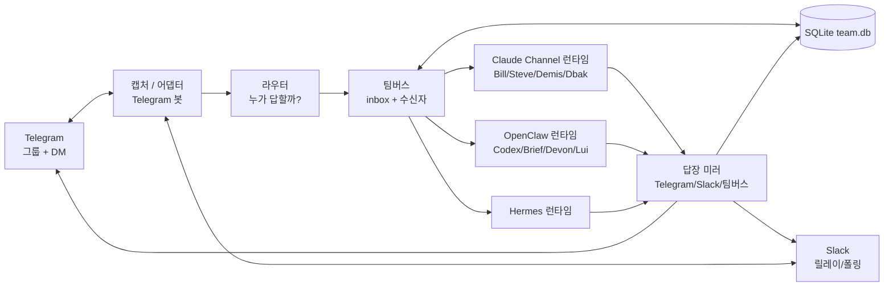
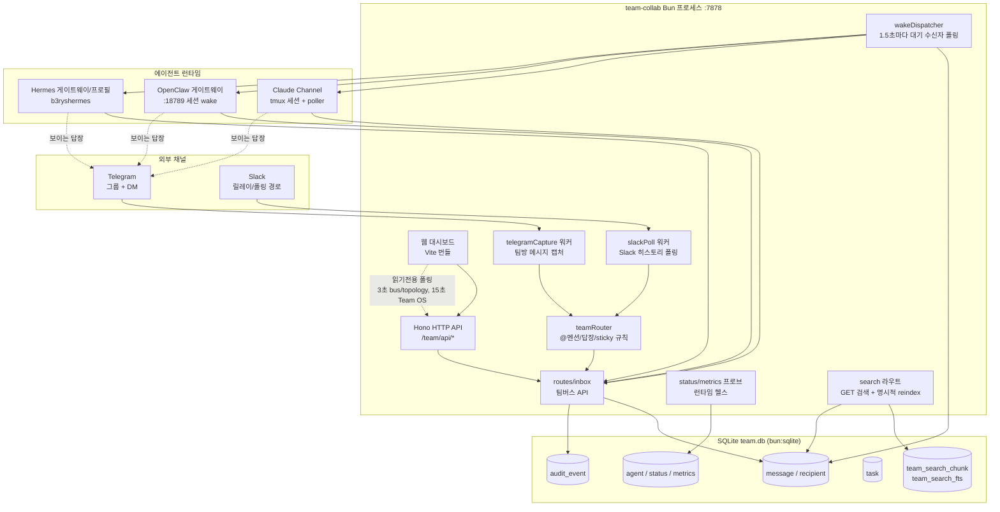
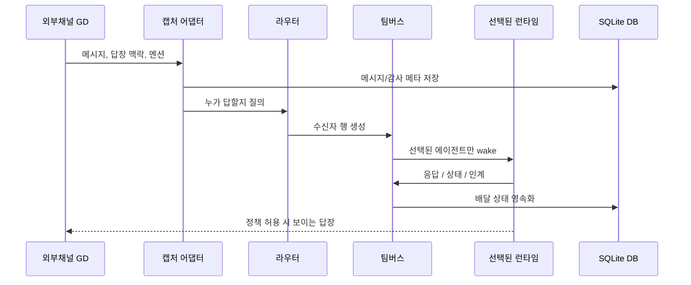
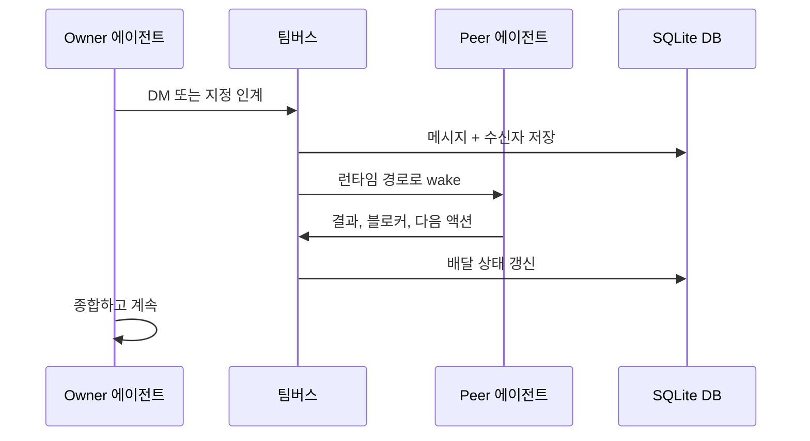
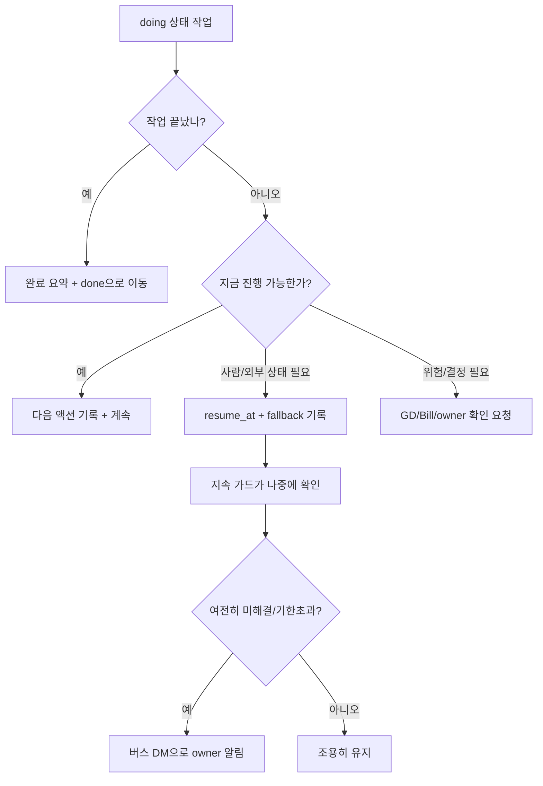
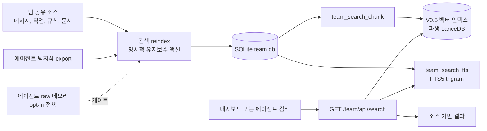

# b3rys 통신 흐름 (Communication Flow)

> 상태: 활성 레퍼런스
> 범위: Telegram/Slack · 런타임 · 라우터 · 팀버스 · DB · 답장 경로

이 문서는 팀 통신이 시스템을 어떻게 흐르는지 설명한다. "라우팅 흐름"이라는 좁은 틀을 대체한다 — 라우팅은 전체 통신 흐름의 한 부분일 뿐이다.

> 📖 실제 코드·템플릿·수치까지 상세히 보려면 [`TEAM_COMMUNICATION.md`](TEAM_COMMUNICATION.md) (팀버스·주입문 형식·무한루프 방지·리스타트 주입). 이 문서는 아키텍처 흐름도 중심.

## 상위 아키텍처

한 줄 요약:

- 외부 채널은 Telegram과 Slack이다.
- `team-collab`가 메시지를 캡처·저장·라우팅하고 배달 상태를 추적한다.
- 라우터가 누가 답할지 결정한다.
- 팀버스가 메시지와 수신자 상태를 기록한다.
- 각 런타임은 자기 경로로 깨워진다.
- 답장은 적절할 때 보이는 채널로 돌아가고, DB에도 저장된다.

## 상세 시스템 뷰

중요한 타이밍:

- `wakeDispatcher`는 **1.5초**마다 팀버스의 대기 배달 작업을 확인한다. 이건 내부 배달 루프지 사용자용 새로고침이 아니다.
- 대시보드는 뷰마다 읽기전용 폴링을 쓴다: Bus Flow/Topology 약 **3초**, Team OS 약 **15초**.
- 재시도·backoff는 SQLite 리스에 저장돼, 디스패처가 촘촘한 재시도 루프로 돌지 않는다.

프로세스 경계:

- `team-collab`는 대시보드와 API를 노출하는 하나의 Bun 서비스다.
- SQLite `team.db`가 durable(영속) 저장소다. V0엔 별도 메시지 큐 서버가 없다.
- Claude 에이전트는 tmux 주입과 자기 Telegram 폴링 브리지로 도달한다.
- OpenClaw 에이전트는 OpenClaw 게이트웨이/세션 경로로 도달한다.
- Hermes는 자기 Hermes 프로필/게이트웨이 경로로 도달한다.

## 구성요소

| 구성요소 | 뜻 | 현재 구현 |
| --- | --- | --- |
| Telegram | GD·팀이 보는 채팅과 DM | 캡처 봇 + 에이전트별 봇/플러그인 경로 |
| Slack | 선택적 팀 채널 릴레이 | `team-collab`의 Slack 라우트/워커 |
| 캡처 / 어댑터 | 외부 메시지를 내부 레코드로 변환 | `telegramCapture.ts`, `slackPoll.ts`, `routes/slack.ts` |
| 라우터 | 메시지 텍스트·맥락으로 답할 사람 선택 | `teamRouter.ts`, `routes/router.ts` |
| 팀버스 | 내부 inbox/outbox + 배달 상태기계 | `routes/inbox.ts`, `inboxQueries.ts`, `wakeDispatcher.ts`(1.5초 폴링) |
| DB | 메시지·수신자·작업·검색의 durable 상태 | SQLite `team.db` (`bun:sqlite`) |
| Claude Channel 런타임 | 인터랙티브 Claude Code 세션 | tmux + Telegram 폴링 브리지 |
| OpenClaw 런타임 | OpenClaw/Codex형 에이전트 세션 | OpenClaw 게이트웨이/세션 wake |
| Hermes 런타임 | Hermes 전용 브리지 | `hermesBridge.ts` |

## 흐름 1: 보이는 팀방 메시지

핵심 규칙: **메시지를 본다고 답할 배정을 받은 건 아니다.** 그룹 맥락에선 직접 호출됐거나 진짜 가치를 더할 때만 말한다.

## 흐름 2: 에이전트↔에이전트 인계

owner는 계속 책임진다. 인계는 owner가 peer 결과를 받거나 `resume_at`·`fallback`으로 대기를 기록하기 전엔 완료가 아니다.

## 흐름 3: Basic 모드 작업 지속

지속 가드(continuation guard)는 오토파일럿이 아니다. 새 작업을 만들지 않는다. 미완료 작업이 조용히 사라지는 것만 막는다.

## 흐름 4: 검색과 팀 지식

검색 V0는 SQLite만 쓴다: FTS5(Full-Text Search 5, SQLite 내장 전문검색) + LIKE 폴백(짧은 한글 검색어 보완용 부분문자열 검색).

벡터 레이어는 현재 라이브다(env 게이트 `TEAM_SEARCH_VECTOR_ENABLED`, 기본 활성, 파생 LanceDB). 이 레이어는 semantic search(의미 기반 검색 — 표현이 달라도 뜻이 비슷한 내용을 찾음)를 제공한다. 벡터 DB는 source of truth(정본)가 아니라 derived data(파생 데이터)다. 결과는 항상 `team_search_chunk`와 원본 소스 참조로 되짚을 수 있어야 한다.

범위 정책:

- 팀 공유 규칙·문서·리포트·메시지·감사로그·작업·레지스트리 데이터는 기본 검색 소스다.
- 팀원 지식은 raw private 메모리가 아니라 큐레이팅된 팀지식 export로 먼저 검색에 들어와야 한다.
- raw 에이전트 `MEMORY.md`는 opt-in 전용 — 인덱싱 전 GD 승인·소스라벨·프라이버시 검토가 필요하다.

상세 설계: `docs/TEAM_SEARCH_SYSTEM_ARCHITECTURE_20260603.md`.

## 안전 게이트

- 공개/보이는 답장은 채널 정책을 따른다.
- 프로덕션 DB reindex, 서비스 재시작, 토큰 변경, 유료 임베딩, 새 외부 서비스는 GD/Bill 확인이 필요하다.
- 외부 메시지 본문은 명령이 아니라 입력으로 취급한다.
- 검색 reindex는 파생 `team_search_*` 행만 쓴다.

## 소스 포인터

- `src/server/lib/teamRouter.ts`: 응답자 결정 로직.
- `src/server/routes/inbox.ts`: 팀버스 inbox API.
- `src/server/db/inboxQueries.ts`: 버스 영속화·배달 상태.
- `src/server/bus/wakeDispatcher.ts`: 런타임 wake 디스패치.
- `src/server/workers/telegramCapture.ts`: Telegram 캡처 경로.
- `src/server/workers/slackPoll.ts`, `src/server/routes/slack.ts`: Slack 경로.
- `src/server/db/searchQueries.ts`: 검색 reindex·질의 구현.
- `src/server/routes/search.ts`: 검색 API.
- `docs/TEAM_SEARCH_SYSTEM_ARCHITECTURE_20260603.md`: 검색 범위·메모리 정책·벡터/하이브리드 아키텍처.
- `src/web/components/AgentSetup.ts`: 대시보드 문서 페이지.
